# Customer Segmentation & Lifetime Value Analysis

**A RevOps analytical study of 93,349 customers from the Olist Brazilian e-commerce marketplace. Two independent segmentation methods, a documented model failure, and one finding that overturns a standard RFM assumption.**

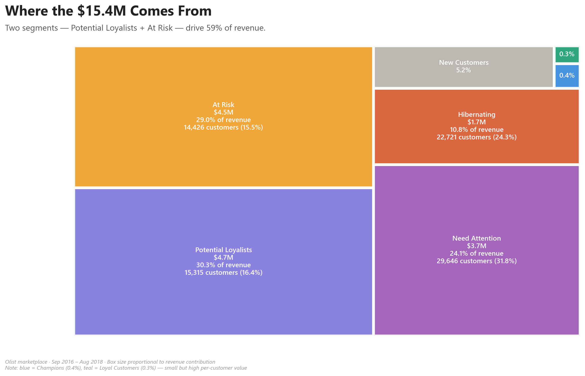

---

## The Story

I expected the highest-value customers in this marketplace to be the "Champions," the textbook RFM segment with high recency, frequency, and monetary scores. The data said otherwise.

In Olist's customer base, the top 20 highest-CLV customers contain zero Champions and zero Loyal Customers. They sit entirely inside the Potential Loyalists and At Risk segments, populations that traditional RFM playbooks treat as lower priority. Two segments, 32% of the customer base, drive **59% of the $15.4M in revenue**, and both sit one purchase away from churning.

This is a study of how rule-based segmentation, unsupervised clustering, and probabilistic CLV modeling converge (and where they don't) on a real marketplace dataset.

---

## Key Findings

### 1. Revenue is concentrated in two churn-vulnerable segments

Potential Loyalists (30.3% of revenue) and At Risk (29.0% of revenue) together drive **59% of the $15.4M total**. By construction, both segments are one purchase away from slipping into Hibernating. The most valuable customers in this marketplace are also the least secure, which inverts the typical retention investment heuristic.

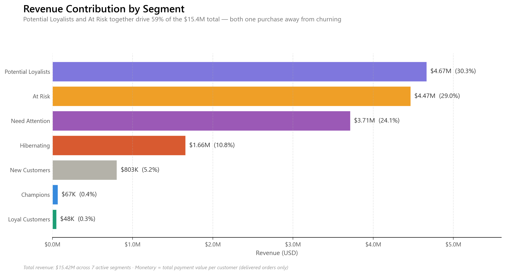

### 2. Two independent methods agree on the customer structure

I segmented customers two ways: rule-based RFM scoring (8 named segments) and unsupervised K-Means clustering on raw recency and monetary values (3 clusters). The methods converged with striking precision. 99% of Potential Loyalists landed in the same K-Means cluster, 84% of Hibernating customers landed in the Lapsed cluster, and 100% of Champions landed in High-Value Core. **The segmentation is not a scoring artifact. It reflects real behavioral structure in the data.**

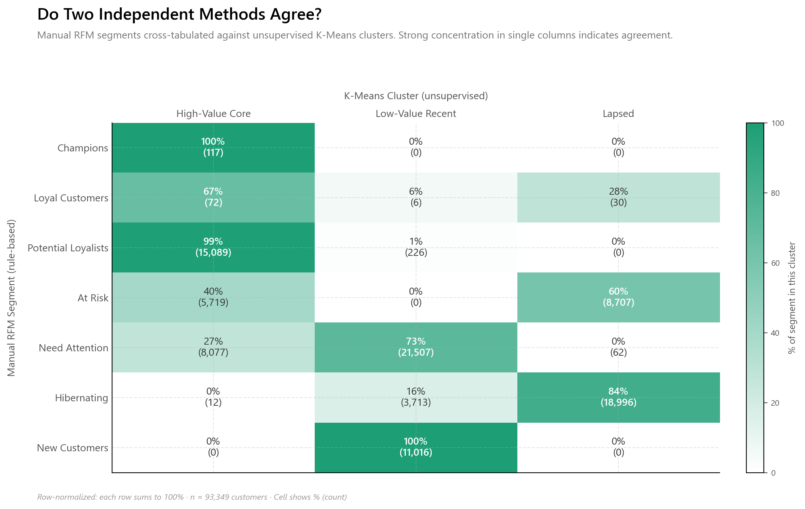

### 3. The "At Risk" segment is actually two distinct populations

Manual RFM treats At Risk as a single segment, but K-Means revealed a 40/60 split. 40% remain operationally recoverable in the High-Value Core cluster, while 60% have crossed into Lapsed. **This is where the layered methodology earned its keep.** A finding invisible to either method alone. Different populations warrant different interventions: high-touch retention for the recoverable cohort, low-cost winback campaigns for the lapsed cohort.

### 4. The "Champions are most valuable" assumption fails in early-stage marketplaces

The top 20 highest-CLV customers in Olist are 50% Potential Loyalists and 45% At Risk. **Zero Champions. Zero Loyal Customers.** This is a direct consequence of the marketplace's growth stage. With 97% one-time buyers, the frequency dimension drags Champions into a tiny bucket of small-basket repeat buyers (only 117 customers), while the actual high-monetary customers get tagged as At Risk based on their recency. In early-stage marketplaces, the playbook misallocates retention spend.

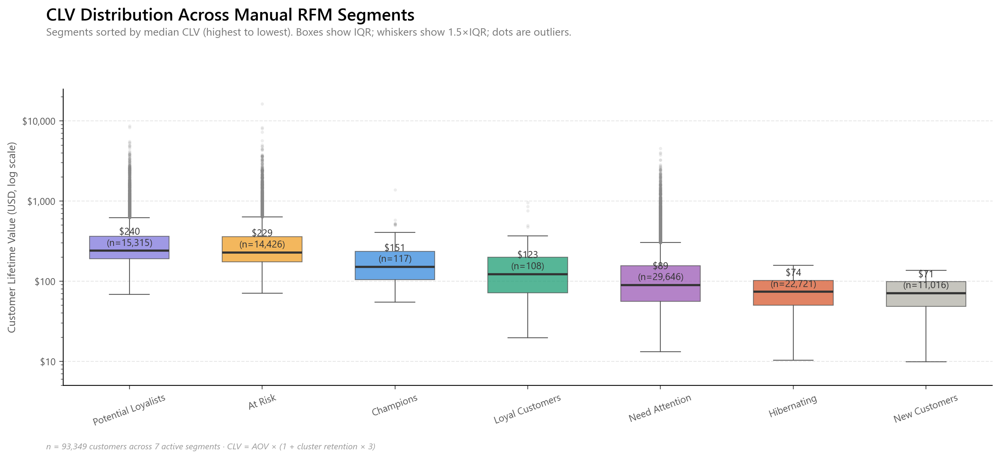

### 5. Probabilistic CLV (BG/NBD) was attempted and honestly rejected

I attempted to fit a BG/NBD probabilistic CLV model on the 2,801 repeat purchasers. The model failed to converge across three regularization settings (penalizer 0.001, 0.1, and 1.0). Root cause: 91.9% of repeat purchasers have exactly one repeat purchase within a median of 34 days, a degenerate distribution that violates BG/NBD's assumption of smooth purchase-rate heterogeneity. Rather than force a model that wouldn't be defensible, I documented the failure as a finding about the marketplace and pivoted to a deterministic CLV with cluster-specific retention multipliers derived from observed Olist behavior. **This is the kind of model-selection judgment I'd carry into a production analytics role.**

---

## Methodology

The project moves through five layers, each building on the previous.

**Data engineering layer.** Nine raw Olist CSVs loaded into a PostgreSQL database with a schema that respects foreign key relationships. Data quality checks documented a critical analytical decision: the effective snapshot date is August 29, 2018 (not the latest order date), because post-August orders weren't yet delivered in the data window. A materialized view pre-joins the customer, order, and payment tables into a single analytical surface that every downstream analysis reads from.

**RFM segmentation.** Customers scored 1 to 5 on recency, frequency, and monetary dimensions, with quintile-based cutpoints. The combined scores map to 8 named segments using a rules dictionary. Importantly, `customer_unique_id` (not `customer_id`) is used for grouping, because the latter is per-order rather than per-customer.

**K-Means clustering.** Performed on raw recency and log-transformed monetary values, standardized to zero mean and unit variance. Frequency was deliberately dropped from the clustering features. With 75% of customers having frequency = 1, the dimension adds no separation signal and would introduce noise. The optimal number of clusters (k = 3) was selected using elbow method and silhouette score, with both metrics independently agreeing.

**CLV modeling.** Probabilistic CLV via BG/NBD attempted and rejected based on data diagnostics (see Finding 5). Replaced with a deterministic formulation: `CLV = avg_order_value × (1 + cluster_retention_rate × 3)`, where the retention rate is the observed repeat probability within each K-Means cluster and the multiplier projects three quarterly windows of the 22-month data horizon.

**Validation layer.** RFM segments cross-tabulated against K-Means clusters to test whether the two methods converge. They do, and the disagreements (notably the At Risk split) are themselves findings.

---

## Visual Walkthrough

The complete analytical arc in 12 figures, grouped by phase.

### Setup & Context

**Figure 1. Data Quality Summary.** The analytical universe at a glance: 96,469 delivered transactions across 93,349 unique customers generating $15.4M in revenue.

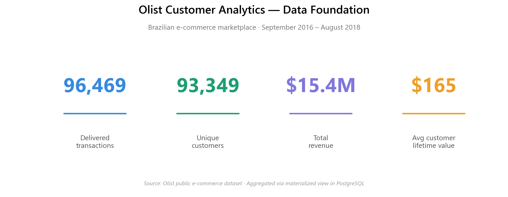

**Figure 2. Order Volume Over Time.** Marketplace growth from late 2016 through August 2018, peaking at the November 2017 Brazilian Black Friday. The hockey-stick growth shape contextualizes the 97% one-time buyer rate as partially a data-window artifact.

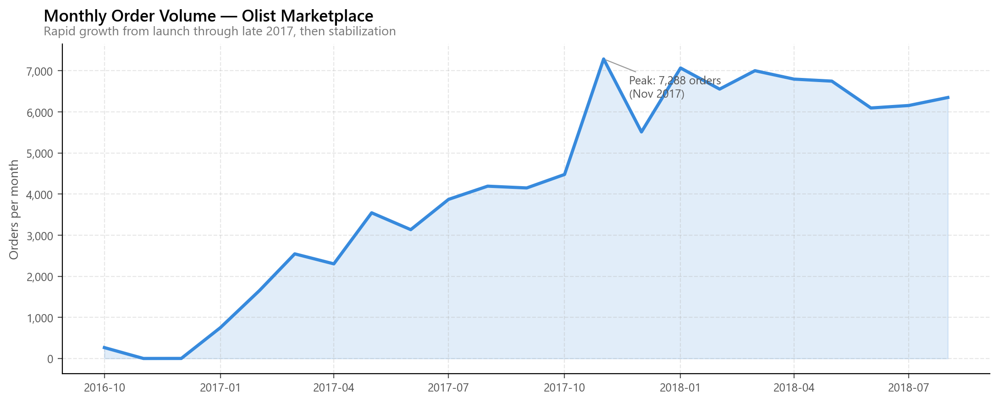

### RFM Segmentation

**Figure 3. RFM Score Distributions.** Histograms of Recency, Frequency, and Monetary values across the customer base. The F=1 dominance becomes visually undeniable here.

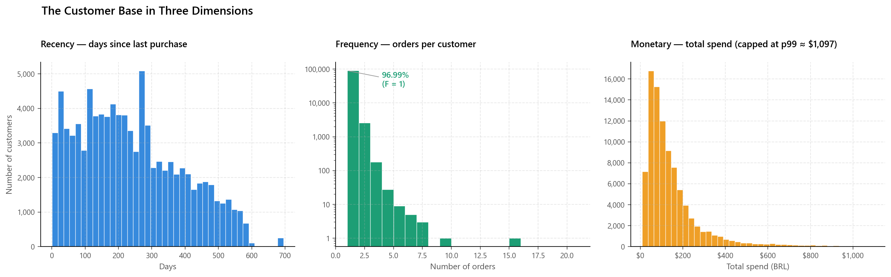

**Figure 4. Segment Revenue Treemap.** The headline figure of the analysis. Two segments (Potential Loyalists and At Risk) drive 59% of total revenue.


**Figure 5. Segment Sizes.** Customer count per segment, sorted descending. Need Attention and Hibernating dominate the base while Champions are a sliver of 117 customers.

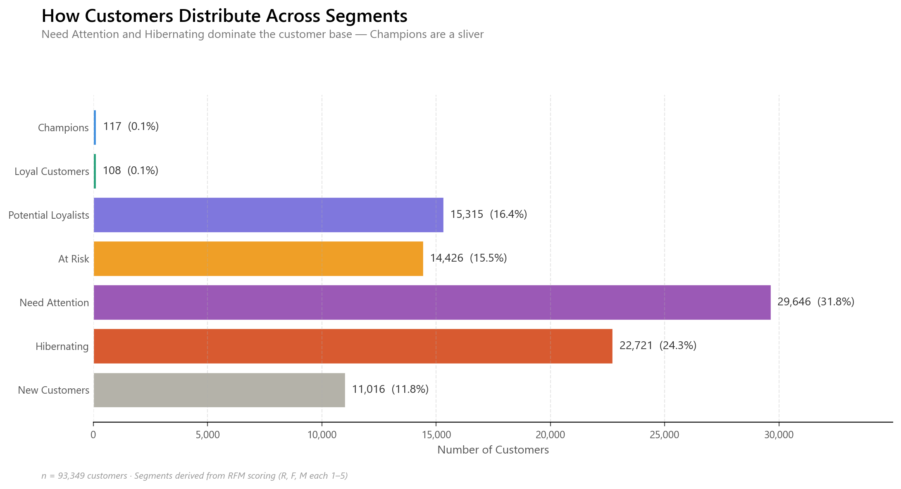

**Figure 6. Revenue Contribution by Segment.** Total revenue per segment in dollar terms. The decoupling of customer count and revenue share is visible here: Need Attention has the most customers but only 24% of revenue.


### K-Means Clustering & CLV

**Figure 7. Elbow Method + Silhouette Score.** Two independent metrics for selecting the optimal number of clusters. Both agree on k = 3.

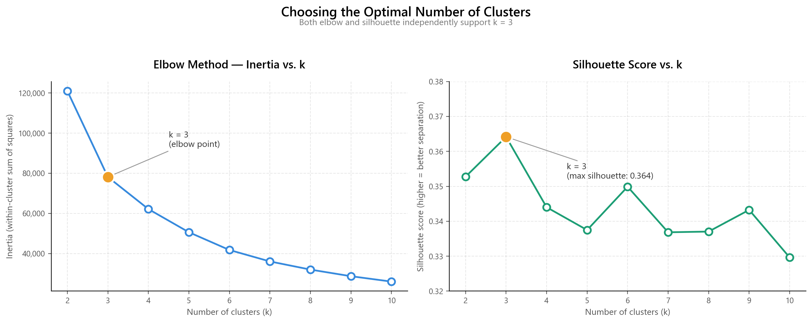

**Figure 8. K-Means Cluster Scatter.** The three clusters visualized in Recency and Monetary space, with cluster centroids marked. Vertical separation near recency = 250 days is striking.

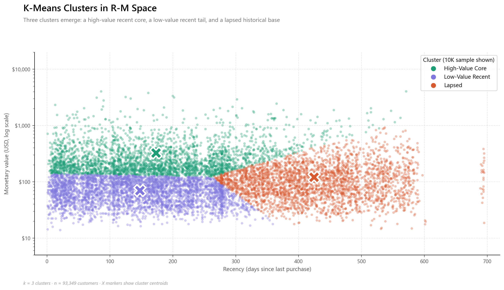

**Figure 9. Segment vs Cluster Crosstab.** The validation figure. Manual RFM segments cross-tabulated against unsupervised K-Means clusters. Strong diagonal concentration confirms cross-method agreement.


**Figure 10. CLV Distribution by Cluster.** Each cluster occupies a distinct band of the lifetime value distribution. Cluster medians: Low-Value Recent $68, Lapsed $104, High-Value Core $249.

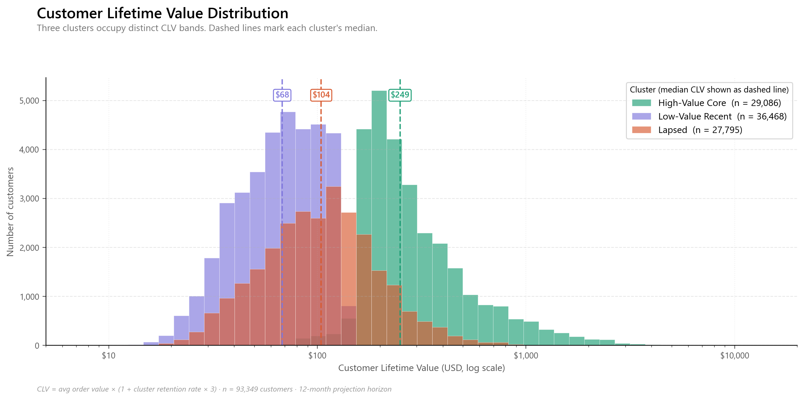

**Figure 11. CLV by Manual Segment.** Boxplots of CLV across the 7 active manual segments, sorted by median value. The counter-intuitive finding lives here: Potential Loyalists and At Risk lead, Champions do not.


**Figure 12. Top 20 Customers by CLV.** The actionable retention list. All 20 sit in the High-Value Core cluster; 95% are tagged At Risk or Potential Loyalists by manual RFM. Zero Champions.

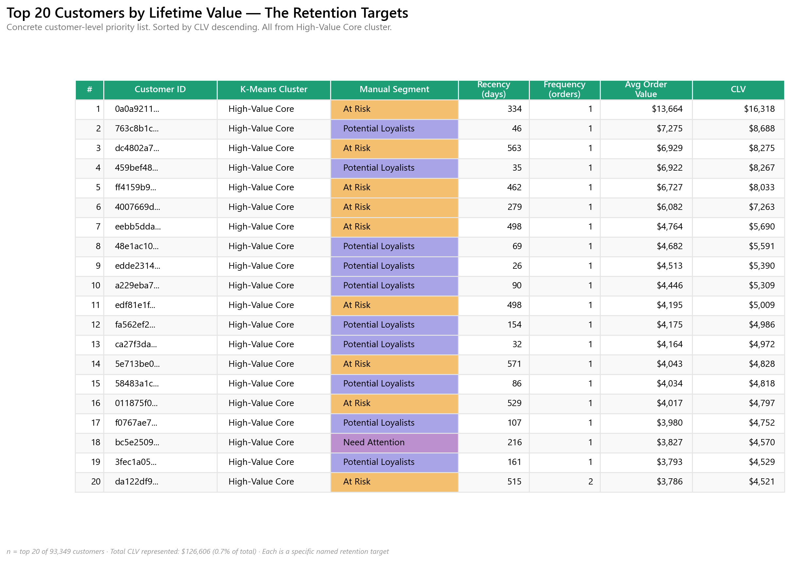

---

## Tech Stack

* **PostgreSQL.** Relational storage of 1.5M rows across nine tables, with a materialized view as the analytical surface.
* **Python (pandas, NumPy).** Analytical core, RFM scoring, CLV calculation.
* **scikit-learn.** K-Means clustering, StandardScaler, silhouette scoring.
* **lifetimes.** BG/NBD model fitting (attempted; see Finding 5).
* **matplotlib.** All 12 figures, designed as a unified visual system.
* **psycopg2 + SQLAlchemy.** Database connection layer with `.env` based credential management.
* **Jupyter.** Analytical notebook (`notebooks/01_rfm_analysis.ipynb`).

---

## Reproduce This Analysis

```bash
# Clone the repo
git clone https://github.com/sivakumar-reddy/revops-customer-segmentation.git
cd revops-customer-segmentation

# Set up the environment
python -m venv venv
venv\Scripts\activate          # Windows
pip install -r requirements.txt

# Configure database credentials
# Create a .env file at the project root with:
#   DB_USER=postgres
#   DB_PASSWORD=your_password
#   DB_HOST=localhost
#   DB_PORT=5432
#   DB_NAME=olist
```

Then load the Olist dataset into PostgreSQL using the SQL scripts in `sql/` (in numerical order), and open `notebooks/01_rfm_analysis.ipynb` in Jupyter.

---

## What I'd Do Differently in Production

This is a portfolio study, not a production system. If I were deploying this analysis at a company:

* **Materialized view refresh** would run on a nightly schedule via Postgres cron or Airflow, with monitoring on row counts and freshness.
* **Segment definitions** would live in a version-controlled configuration file rather than inline Python dictionaries, so marketing and analytics teams could iterate on segment rules without code changes.
* **CLV outputs** would be written back to a customer-facing table with timestamped versioning, so downstream tools (CRM, BI dashboards) can read the same CLV values used in any given period.
* **The K-Means model** would be retrained quarterly with drift monitoring, since cluster boundaries shift as the marketplace matures and one-time buyers convert to repeaters.

---

## Contact

**Sivakumar Reddy Yenna**
Recent MS in Management Information Systems, Northern Illinois University

Open to **Business Analyst, BI Analyst, and Marketing Analyst** roles in the **Chicago metro area or anywhere in the US**.

* **Email:** reddysivakumar1361@gmail.com
* **LinkedIn:** [linkedin.com/in/sivakumar-reddy-yenna](https://www.linkedin.com/in/sivakumar-reddy-yenna)
* **Other projects:** [Logistics Analytics Dashboard](https://github.com/sivakumar-reddy/logistics-analytics)
